Grocify

The purpose of Grocify is to establish a user-centric online grocery shopping platform, leveraging a combination of HTML, CSS, JavaScript, and React to provide a seamless and visually engaging experience. Grocify aspires to offer a contemporary, responsive, and intuitive interface that simplifies the grocery shopping process. The website's core objective is to enable users to effortlessly browse, select, and purchase grocery items. 

Grocify's responsive design ensures a smooth experience across various devices, and its modern user interface enhances user interaction. Users can conveniently access key features through a persistent navigation bar, including Home, Shop, Sign Up, and Cart, with real-time item count updates. 

By presenting categories, shop items, and a powerful filtering system, Grocify aims to expedite the product discovery process. The Cart component allows users to manage selected items and proceed to checkout seamlessly, enhancing the overall shopping journey. Additionally, the website offers a straightforward login and signup process, further streamlining the user experience. In summary, Grocify's purpose is to revolutionize online grocery shopping, providing a hassle-free and enjoyable platform for users to meet their grocery needs. 

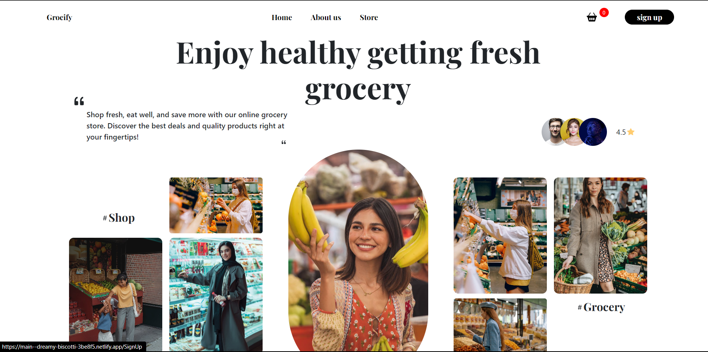

Grocify is a cutting-edge online grocery website, meticulously crafted to offer users an exceptional and hassle-free shopping experience. The website employs a blend of HTML, CSS, JavaScript, and React to deliver a contemporary and responsive design that adapts seamlessly across various devices, ensuring accessibility for all users. 

The website's core components are designed with user convenience in mind: 
Paymet Page
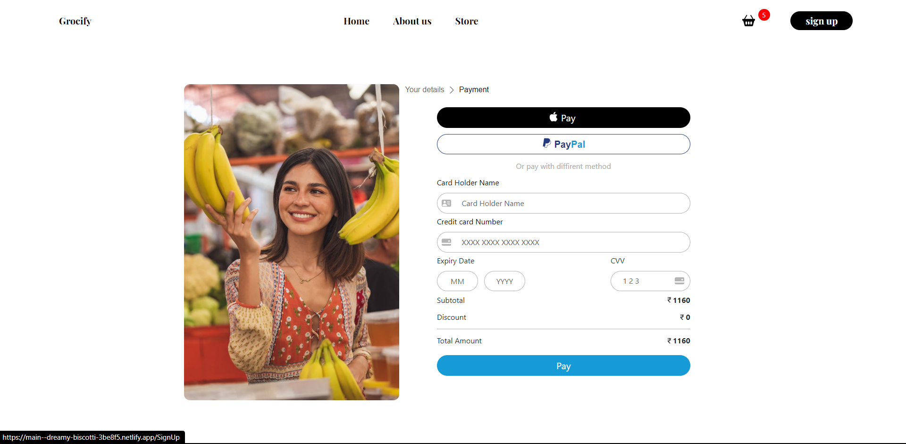
Navigation Bar: A fixed navigation bar serves as the gateway to essential sections such as Home, Shop, Sign Up, and Cart. The Cart link features a real-time item count, allowing users to monitor their selections easily. 

Landing Page: The landing page serves as the website's welcoming gateway, featuring an inspiring quote, the website's rating, and carefully selected images to create an inviting atmosphere. 

Categories: Grocify presents users with a range of product categories, simplifying the process of locating specific grocery items. 
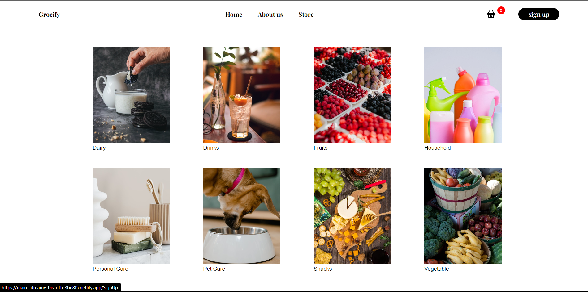
Shop Items: Showcasing top products with images, names, prices, and quantity adjustment options, this component streamlines the process of adding items to the cart. 
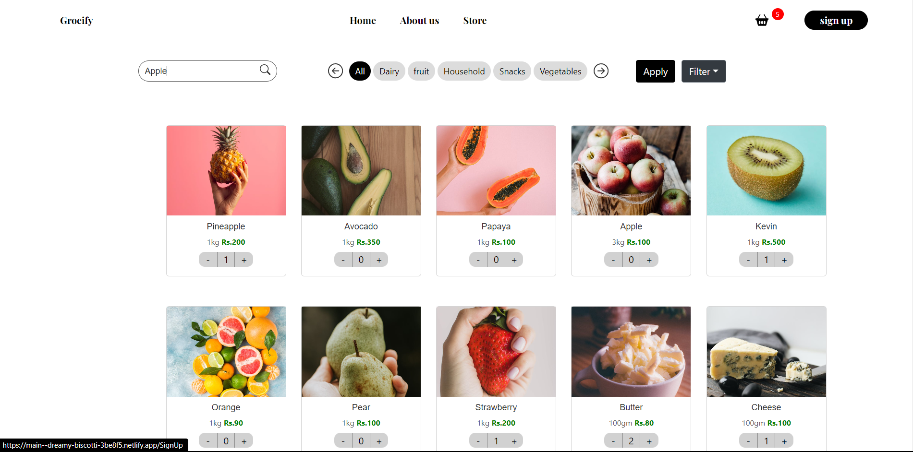

Shop Component: Equipped with advanced filtering and search functionality, this component empowers users to efficiently discover the items they desire. 
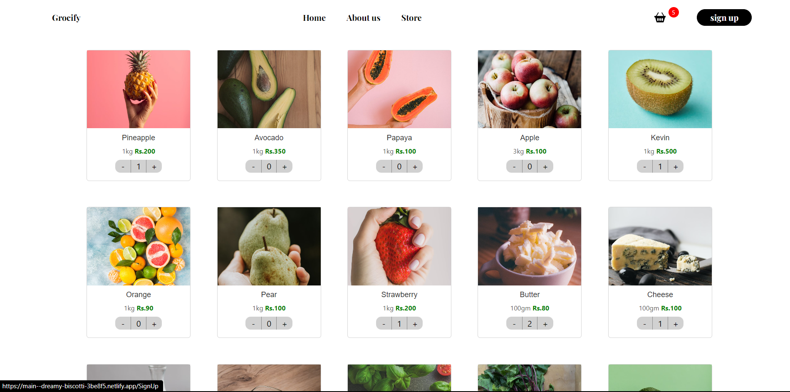
Login/Sign Up: A user-friendly authentication process streamlines access to the platform, ensuring a seamless user experience. 

Cart: Accessible via the navigation bar, the cart component enables users to view, modify, and complete their purchases with selected items. It provides a comprehensive list of cart items and guides users through the checkout process. 

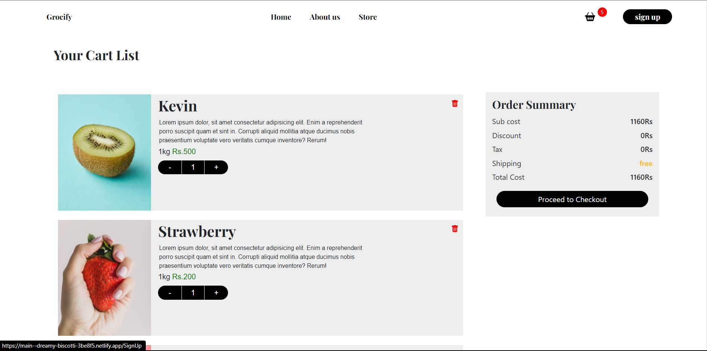
About Us: The About Us page shares insights into the website's mission and offers additional relevant information.
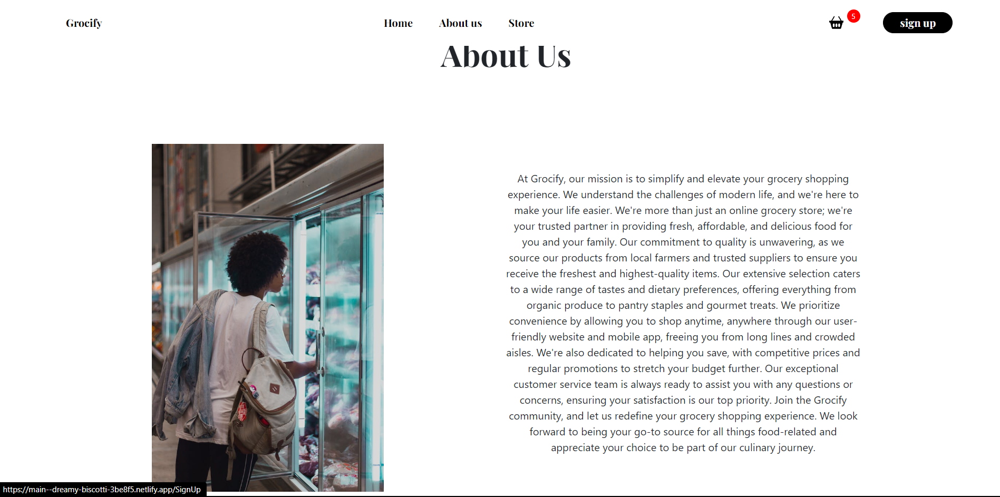

Grocify's primary aim is to provide users with an attractive, user-friendly, and responsive platform for online grocery shopping, enhancing their overall experience from product selection to final purchase. It aspires to be the go-to destination for users seeking a convenient and enjoyable online grocery shopping solution. 

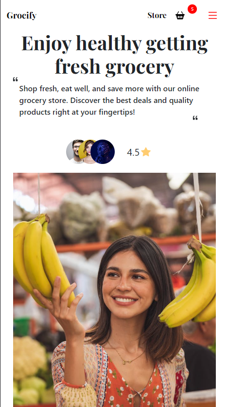
The scope of Grocify, the online grocery website, covers a user-friendly and responsive platform for grocery shopping. Using HTML, CSS, JavaScript, and React, the website offers a modern interface with key components: a fixed navigation bar, landing page, product categories, shop items, About Us section, product filtering, login/sign-up, and a cart. The scope emphasizes efficient product selection, cart management, and user authentication, aiming to create a seamless and visually appealing online grocery shopping experience for users.

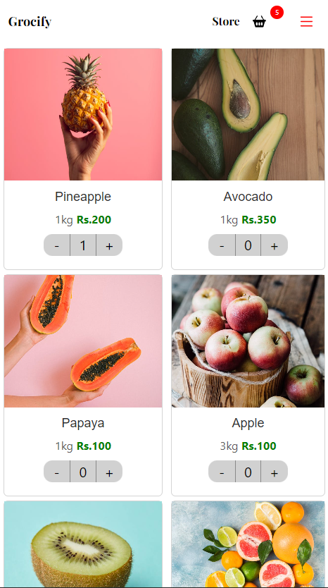{ width=50% }

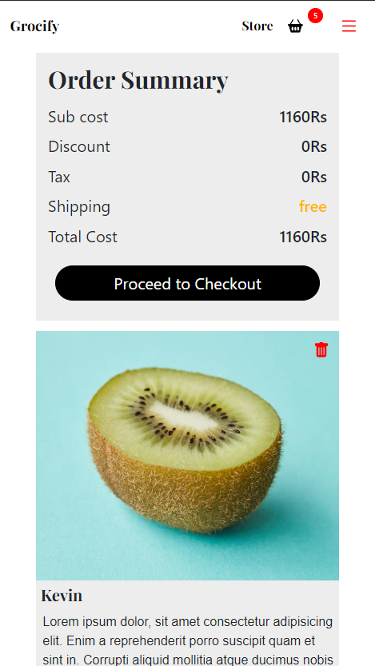

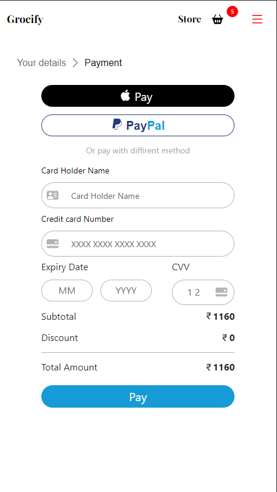
